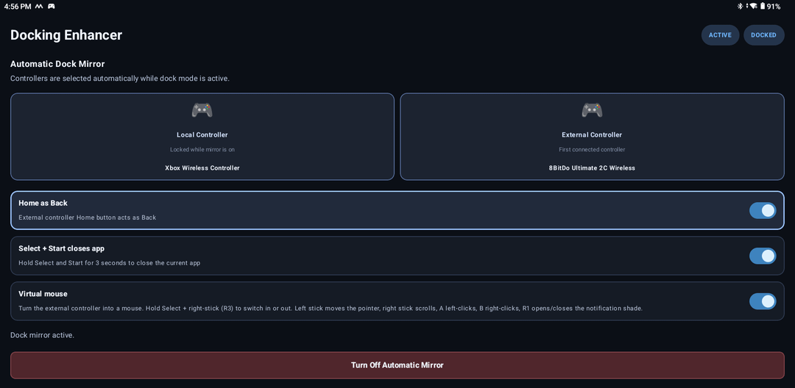
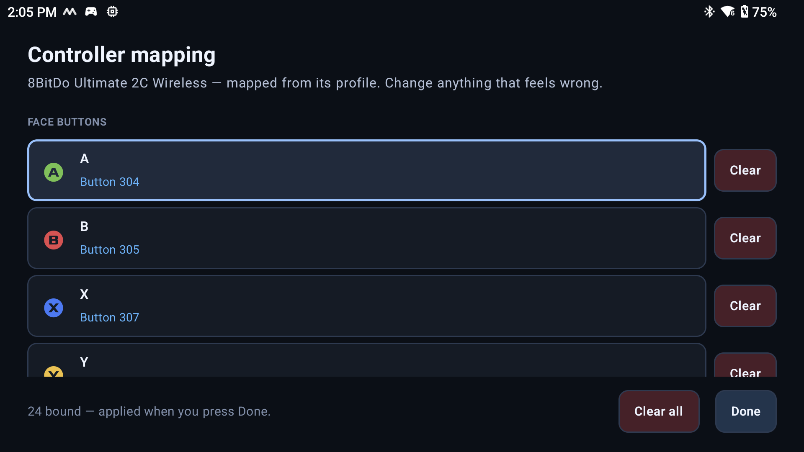

# Docking Enhancer

**Play docked with the controller in your hands — no remapping, no root.**

 

  

## What it does

Dock your handheld to a TV and games still expect its *built-in* controller, not the pad you're
actually holding — so every session starts with remapping. Docking Enhancer grabs your external
controller and replays its input onto the internal controller's input device, so everything just
sees the built-in pad. Nothing to remap, ever.

It runs without root, using a privileged service the stock firmware already ships.
This is the [rodolforubens fork](https://github.com/rodolforubens/docking-enhancer-plus) of
[Docking Enhancer](https://github.com/Ezequiel-CE/Docking-Enhancer), with configurable controller
gestures, recent-app navigation, and controller selection options.

## Features

- **Automatic** — starts on its own while docked, and survives reboots
- **Controller-only activation** — optionally start without an external display
- **Controller selection** — let the app choose automatically or select the external pad you want to use
- **Hides the external pad** while mirroring, so games see one controller instead of a phantom player 2
- **Per-controller button mapping** — press a control to bind it; triggers and stick halves can fill
  button slots, and untouched controls keep working. Pads the bundled
  [SDL database](third-party/gamecontrollerdb/NOTICE.md) knows arrive already mapped
- **Configurable gestures** — assign Home, Back, Recents, close app, virtual mouse, sleep, or no action
  to Home presses and button combinations
- **Recents navigation** — move between tasks with the D-pad, resume with A, and close with X,
  with on-screen button hints on compatible AYN devices
- **Virtual mouse** — Select + R3 turns the pad into a pointer for tapping through Android UI
- **Nintendo layout aware** — swaps A/B and X/Y when targeting the Odin's Nintendo profile
- **Gamepad-navigable UI** — set it up without touching the screen
- **~0.04 ms of added latency** — a fraction of one 60Hz frame ([measured](docs/TECHNICAL.md#latency))

## Default controller actions

Each assignment can be changed under **Controller actions**.

| Gesture | Default action |
| --- | --- |
| Home: single press | Home |
| Home: double press | Back |
| Home: hold for 0.5 seconds | Recents |
| Select + Start: hold for 3 seconds | Close the current app |
| Select + R3: hold for 0.5 seconds | Toggle virtual mouse |

Controller navigation in Recents is designed for AYN's stock recent-apps screen. It may not work
with other launchers.

## Install

1. Download the APK from [Releases](../../releases) and install it (allow "unknown sources" if
   prompted).
2. Open it once. Check that **Local Controller** shows your handheld's built-in pad — tap the card
   to fix it if not — then tap **Turn On Automatic Mirror** and allow notifications.
3. Connect a controller and dock. It takes over on its own.

That's the whole setup, and you only do it once.

To play without a display, set **Automatic start condition** to **Controller** instead of
**Controller + display**. You can choose a specific pad under **External Controller** and customize
shortcuts under **Controller actions**.

Updates from this fork can be installed over its previous releases. If Android reports a conflict
with a version from the original project or another build, uninstall the old app first, then install
this one. Uninstalling clears your settings and saved mappings.

You only need the `.apk` file. The optional `SHA256SUMS.txt` file is for checking download integrity.

## Supported devices

| Device | Status |
| --- | --- |
| **AYN Odin 2 / Portal** | Tested, primary target |
| **AYN Thor** | Includes compatibility fixes for controllers and docking; the built-in second screen is not treated as an external display |
| **AYN Odin 2 Mini** | Not supported — [ships the service but it doesn't respond](docs/TECHNICAL.md#the-odin-2-mini) |
| Other handhelds with `PServerBinder` | Likely work, untested |

Support is decided at runtime by whether the firmware's service actually answers — not by a model
list — so any handheld with a working one has a good chance. Devices without it are told so instead
of silently doing nothing.

## How it works

A small native daemon reads the external controller, grabs it exclusively, and replays every event
onto the internal controller's `/dev/input` node. While mirroring it also unlinks the external pad's
node so Android drops it from the device list, and puts it back on exit.

Privileged work goes through the stock firmware's `PServerBinder` service via a raw binder
transaction — the same no-root technique used by ClusterTune and PULSE.

Details, design notes and the build instructions live in **[docs/TECHNICAL.md](docs/TECHNICAL.md)**.

## Credits

Original Docking Enhancer project by [Ezequiel-CE](https://github.com/Ezequiel-CE/Docking-Enhancer).

The no-root PServer technique comes from [**ClusterTune**](https://github.com/AurelioB/ClusterTune),
and the `PServerBinder` access code is adapted from [**PULSE**](https://github.com/keiretrogaming/pulse).
Full third-party notices in [NOTICE.md](NOTICE.md).

Built with heavy help from an AI coding assistant (Anthropic's Claude), always directed and reviewed
by the maintainer — every change compiled, unit-tested and confirmed on a real handheld before
shipping. Spelled out here for transparency.

Not affiliated with AYN.

## License

[GNU General Public License v2.0](LICENSE). Please keep the attribution above intact in any fork —
the GPL requires it.
