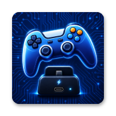

<div align="center">



# Docking Enhancer

**Mirror an external controller onto your handheld's built-in controller — no root, no Magisk.**


</div>

---

## Overview

On handhelds like the **AYN Odin 2 family**, docking to a TV is great — until you realize games and the system still expect the _built-in_ controller, not the pad in your hands. **Docking Enhancer** fixes that: it grabs an external controller — Bluetooth or wired — and replays its input onto the internal controller's input device, so everything sees your external pad as the one that's always been there.

It runs a small native daemon that reads the external controller and writes into the internal controller's evdev node, and it does it **without root** — driving the stock firmware's built-in `PServerBinder` service instead of `su`.

> [!IMPORTANT]
> This app only works on devices that ship the `PServerBinder` service (the AYN Odin 2 family and similar handhelds). On any other device it detects the missing service and shows an **"Unsupported device"** notice instead of running — verified on an ordinary phone, which is turned away rather than left misbehaving.

## Features

- **Automatic dock mirror** — while docked, the internal and external controllers are detected and mirrored automatically; no manual setup per session.
- **External pad hidden while mirroring** — the external controller disappears from Android's device list for as long as the mirror runs, so games and the system see exactly one controller instead of a phantom second player. Works with any brand, and the node is put back on exit.
- **No root required** — privileged work goes through the firmware's `PServerBinder` service, so there's no Magisk, no su prompt, nothing to unlock.
- **Home as Back** — optionally map the external controller's Home button to Android Back.
- **Select + Start to close** — hold Select and Start for 3 seconds to force-stop the foreground app.
- **Virtual mouse** — flip the external controller into an on-screen mouse with a button combo, for tapping through Android UI a gamepad can't reach — cursor, scroll, clicks, and a shortcut for the notification shade, all no-root.
- **Odin layout aware** — swaps the A/B and X/Y face buttons when targeting the Odin's Nintendo-style profile.
- **Fully gamepad-navigable UI** — a Compose + Material 3 interface you can drive entirely from the controller.
- **Resilient by design** — a foreground supervisor service auto-starts, restarts on disconnect, and survives reboots; liveness is tracked with a heartbeat, not a fragile process-name check.

## Supported devices

| Device                               | SoC                | Android | Notes                           |
| ------------------------------------ | ------------------ | ------- | ------------------------------- |
| **AYN Odin 2 / Portal**              | Snapdragon 8 Gen 2 | 13      | Primary target, hardware-tested |
| Other handhelds with `PServerBinder` | Qualcomm           | —       | Likely work; not tested         |

> [!NOTE]
> Support is gated at runtime purely on whether the `PServerBinder` service exists — not on a model list — so any handheld that ships it has a good chance of working.

## How it works

The heavy lifting is a tiny native C binary ([`input_mirror.c`](android/app/src/main/native/input_mirror.c)) shipped as an app asset:

1. It opens the **source** (external controller) read-only and grabs it exclusively (`EVIOCGRAB`) so its input no longer leaks to the system directly.
2. It opens the **target** (internal controller) read-write and replays every event onto it, so the whole system sees the external pad as the internal one.
3. It **unlinks the external controller's `/dev/input` node**, which makes Android drop it from the device list — the daemon's already-open handle keeps working, so it goes on reading a controller nothing else can see. The node is recreated on exit.
4. It writes `pid` and `heartbeat` files the app polls to track liveness.

> [!NOTE]
> Hiding the external pad leans on two POSIX/Android details. An open file descriptor outlives `unlink()`, so deleting the node cuts the framework off without costing the daemon its input stream — Android's `EventHub` watches `/dev/input` with inotify and drops the device the moment the entry vanishes. Restoring it is the fiddly half: the node is rebuilt (`mknod` + owner `root:input` + `0666` + the `u:object_r:input_device:s0` SELinux label) in a staging path **outside** `/dev/input`, then hard-linked into place, so `EventHub` only ever sees a fully-labelled node and never races a half-built one. Before unlinking anything the daemon confirms the node's identity via `EVIOCGID`, and it records what it hid to a state file so a crash can be healed rather than leaving a controller invisible.

To run that binary with the access it needs — **without root** — the app uses the same no-root technique pioneered by ClusterTune and PULSE: the stock firmware ships a privileged `PServerBinder` service, obtained via reflection and driven with a raw binder transaction, that executes a shell command as root. The app funnels all privileged work through it ([`PServerShell`](android/data/src/main/java/com/odininputmirror/data/PServerShell.kt) / [`PServerExec`](android/data/src/main/java/com/odininputmirror/data/PServerExec.kt)).

> [!NOTE]
> `PServerBinder` returns only the first line of a command's stdout and no exit code, so reads stage their full output through a file and status checks use a stdout token. The daemon is launched in the foreground inside a backgrounded `sh` script — never `setsid` or an inline `&`, because the binary handles `SIGHUP` and would otherwise exit cleanly the moment the call returns.

## Use guide

Setup is a one-time thing — flip it on once and it runs itself from then on.

1. **Install and open** Docking Enhancer on the handheld. The first launch registers a lightweight foreground service that supervises the mirror.
2. **Turn the mirror on.** Tap the big **Turn On Automatic Mirror** button at the bottom. This is the only step you do by hand, and you only do it **once** — the choice is saved, so you can leave it enabled for good and never open the app again.
3. **Connect and dock.** Hook up an external controller — pair it over Bluetooth or plug it in by USB — and dock the device. The mirror is built for docked play and only runs while docked.
4. **It takes over on its own.** With Automatic Mirror enabled, the background service picks up the external controller and starts mirroring by itself whenever there's a docked session with a controller present — the header flips to `ACTIVE` / `DOCKED` and the status reads _Dock mirror active_. Turn a controller off and it pauses and waits; reconnect or re-dock and it resumes, no app needed. While it's mirroring the external pad drops off Android's device list on purpose — that's the mirror doing its job, and the pad reappears once it stops.

To stop for good, open the app and tap **Turn Off Automatic Mirror**.

### Options

- **Local / External controller cards** — show what's detected. The internal controller is auto-detected on recognized handhelds and locked while mirroring; if it guesses wrong, tap the local card to pick it by hand.
- **Home as Back** — the external controller's Home button acts as Android Back.
- **Select + Start closes app** — hold both for 3 seconds to force-stop the current foreground app, handy for bailing out of a game from the couch.
- **Virtual mouse** — hold **Select + right-stick click (R3)** to switch the external controller into a mouse, and the same combo to switch back. The left stick moves the pointer, the right stick scrolls, **A** left-clicks, **B** right-clicks, and **R1** opens or closes the notification shade. It's built for navigating Android menus from the couch when no touchscreen is in reach; internally it creates its own no-root `uinput` pointer while mouse mode is on.

> [!TIP]
> The whole UI is gamepad-navigable — you can set everything up from the external controller without touching the screen.

## Notes and limitations

- Event node paths (`/dev/input/eventX`) are unstable across reconnects and reboots; the app resolves controllers by GUID first, then path.
- Controller GUIDs are derived from vendor + product only, so two identical controllers of the same model share a GUID and can't be told apart — an uncommon case on a handheld (typically one built-in plus one external of a different model).
- "Home as Back" injects an Android Back key event at the framework level. Apps that read controllers directly via evdev (e.g. some emulators) may not react to it.
- Hiding the external controller removes its `/dev/input` node while the mirror runs, so it is invisible to everything. The pad stays connected at the transport level — still paired in Bluetooth settings, still enumerated over USB — it just no longer exists as an input device to anything but the daemon. It comes back on a clean stop; if the daemon is killed hard, the supervisor heals the orphaned node on its next tick (the app also does it at startup), so the controller recovers on its own rather than staying hidden.
- Writing directly to an internal controller's evdev node depends on the device exposing it that way; the core mirror targets the built-in controller rather than creating a virtual `uinput` device. (The optional virtual mouse is the exception — it creates its own `uinput` pointer while active.)
- The virtual mouse can't drag the notification shade open the way a finger swipe does, so **R1** opens/closes it via a system command instead. The app tracks that open/closed state itself, so closing the shade another way (Back, tapping outside) may cost one extra R1 press to resync.

## Getting started

### Prerequisites

- JDK 17
- Android SDK (compileSdk 35) — Android Studio recommended
- Android NDK (only needed to rebuild the native binary; a prebuilt one is committed)
- A supported handheld with `PServerBinder`

### Build the native mirror binary (optional)

A prebuilt binary is committed at `android/app/src/main/assets/input_mirror/input_mirror`, so you only need this to change the C core.

```powershell
# Point to your NDK, e.g.
$env:ANDROID_NDK_HOME = "$env:LOCALAPPDATA\Android\Sdk\ndk\26.3.11579264"
.\scripts\build-input-mirror.ps1
```

The script compiles [`input_mirror.c`](android/app/src/main/native/input_mirror.c) for `arm64-v8a` and drops the result back into the assets folder.

### Build and install the app

```powershell
.\android\gradlew.bat -p .\android :app:assembleDebug
adb install -r .\android\app\build\outputs\apk\debug\app-debug.apk
```

Or in one step on a connected device:

```powershell
.\android\gradlew.bat -p .\android :app:installDebug
```

## Tech stack

Kotlin 2.0.21 · Jetpack Compose + Material 3 (BOM 2024.10.01) · Gradle 8.11.1 · AGP 8.7.3 · JVM 17 · minSdk 28 · target/compileSdk 35.

## Development and AI assistance

Docking Enhancer is built with heavy help from an AI coding assistant (Anthropic's Claude). A good part of the source, plus most of this README and the project docs, was written with that assistance — always directed and reviewed by the maintainer. Nothing ships on trust: each change is compiled, unit-tested, and confirmed on a real handheld first.

It's spelled out here for transparency. If you're evaluating, contributing to, or forking the project, it's worth knowing how it comes together.

## License and attribution

Distributed under the **GNU General Public License v2.0** — see [LICENSE](LICENSE).

The no-root PServer technique comes from **ClusterTune**, and the `PServerBinder` access code is adapted from [**PULSE**](https://github.com/keiretrogaming/pulse); full credits and third-party notices live in [NOTICE.md](NOTICE.md). Please keep this attribution intact in any fork or redistribution — the GPL requires it.

Made for the Android handheld community. If it turned docked play on your device into less of a hassle, that's the whole point.
